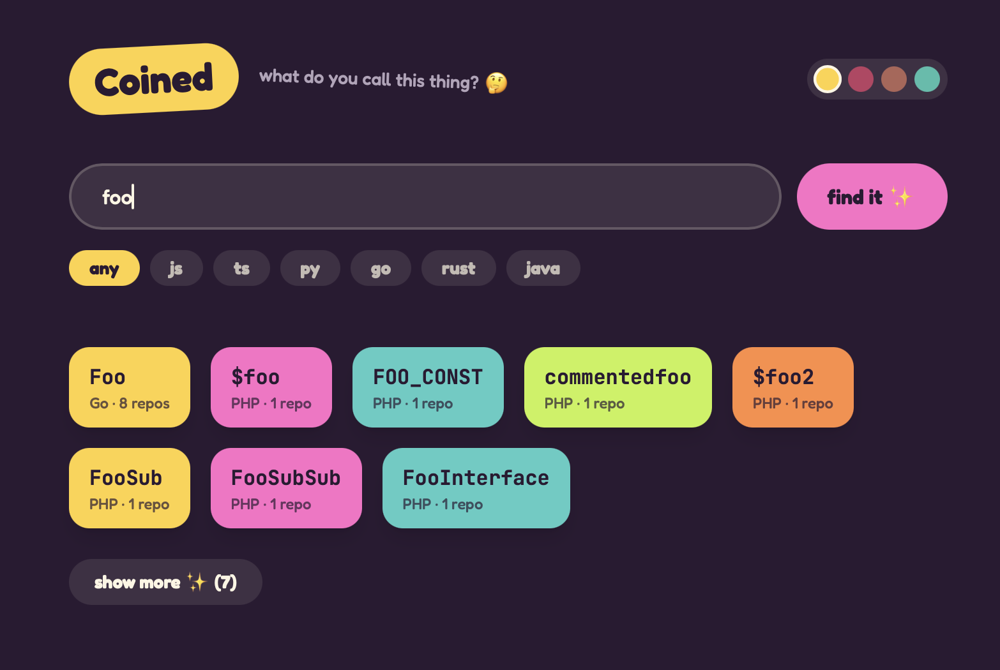

# Coined

**How do other developers name this?** Type what you're trying to name — search real, public code, get back the actual variable/function names people used, grouped by repo and language.



## Why

The obvious tool for this already existed — [Codelf](https://github.com/unbug/codelf) — but its one search backend (`searchcode.com`'s free API) was shut down, and the app's been silently broken ever since. Coined isn't a fork; it's a from-scratch rebuild of the same idea, on top of sources that are actually still alive, with a failover between two of them so it can't die the same way again. Full story in [`docs/architecture.md`](docs/architecture.md).

## Try it

```bash
git clone https://github.com/DarelNC/coined.git
cd coined
npm install
npm run dev
```

Open [http://localhost:3000](http://localhost:3000). Search works immediately — no setup, no API key. It queries [Sourcegraph](https://sourcegraph.com)'s public code search anonymously.

### Optional: GitHub fallback

If Sourcegraph is ever down or rate-limited, Coined can fall back to GitHub's code search — but GitHub requires authentication for that, even for public code. To enable it:

1. Create a [Personal Access Token](https://github.com/settings/tokens) (classic, **zero scopes** — public code search needs none)
2. Copy `.env.example` to `.env.local` and set `GITHUB_TOKEN=<your token>`

Without a token, this fallback is just skipped — the app works exactly the same either way, one source deep instead of two.

## What it does

- Real-world variable/function names, not suggestions — pulled from actual public code
- Falls back between two independent search sources instead of depending on one
- Filter by language, copy any result to your clipboard with one click, load more as you go
- Four color palettes, switchable live, remembered locally (no account, no tracking)

## Stack

Next.js (App Router) + plain JavaScript + Tailwind CSS. No database, no accounts — the whole point is staying small enough that nothing here can quietly rot the way the original did. Full breakdown in [`docs/stack.md`](docs/stack.md).

## The decision log

Every non-trivial choice in this repo — why this stack, why this architecture, why this design direction, what got cut and why — is written down under [`docs/`](docs/), not just implied by the diff. Start with [`docs/architecture.md`](docs/architecture.md) if you're curious how this actually came together.

## Contributing

See [`CONTRIBUTING.md`](CONTRIBUTING.md).

## License

MIT — see [`LICENSE`](LICENSE).
